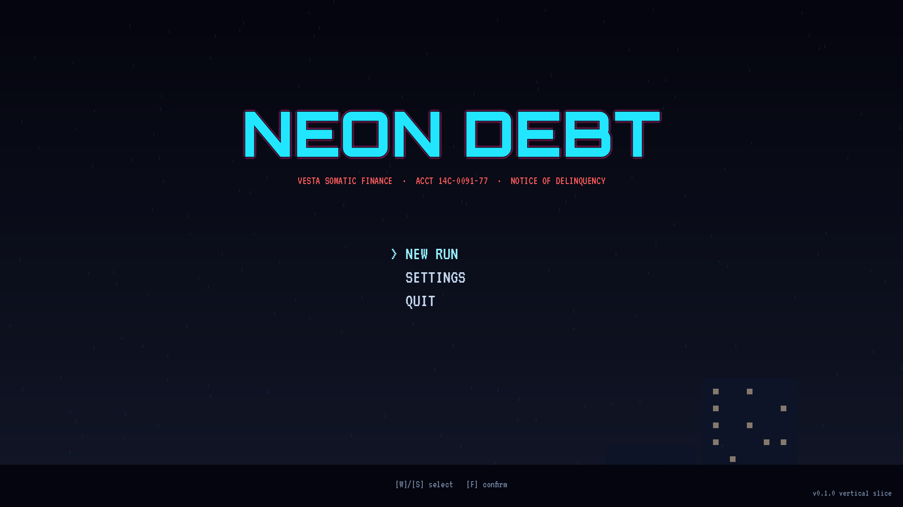
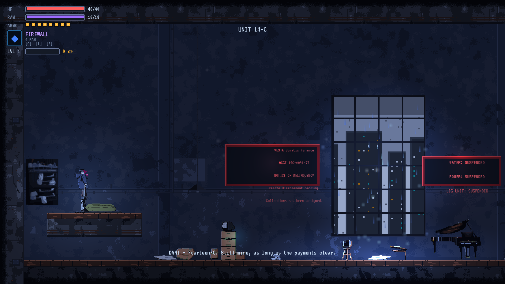
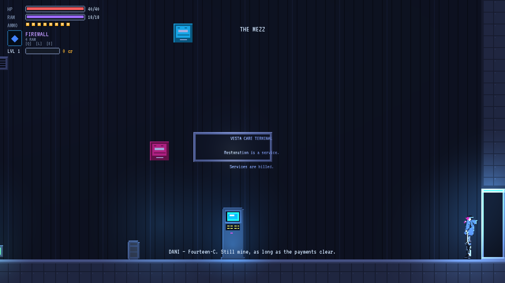
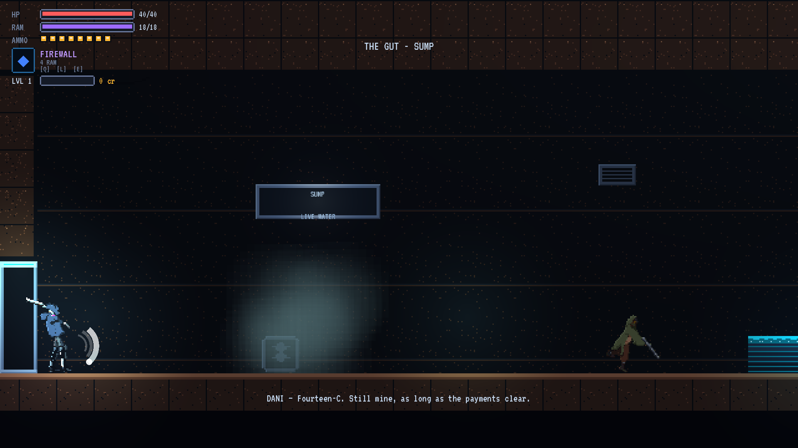
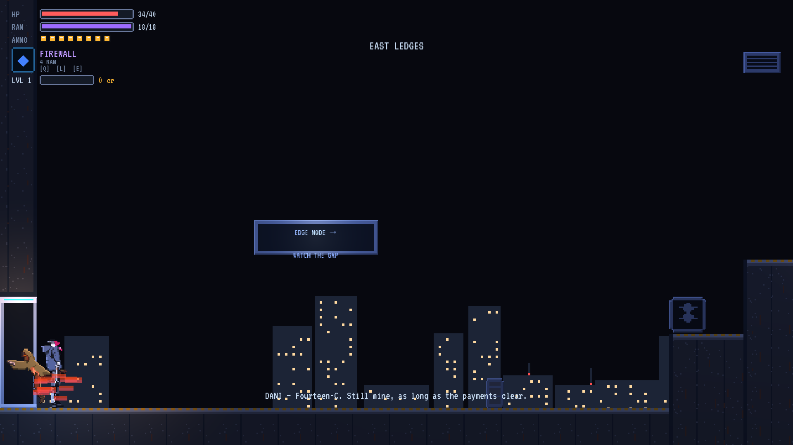
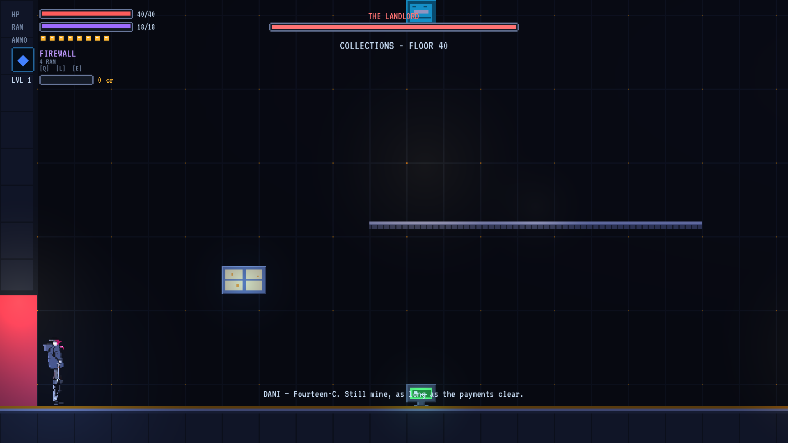
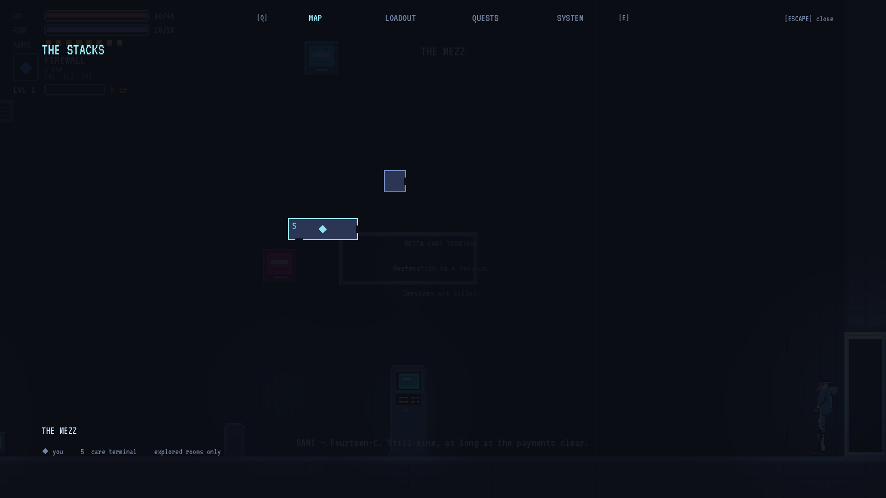
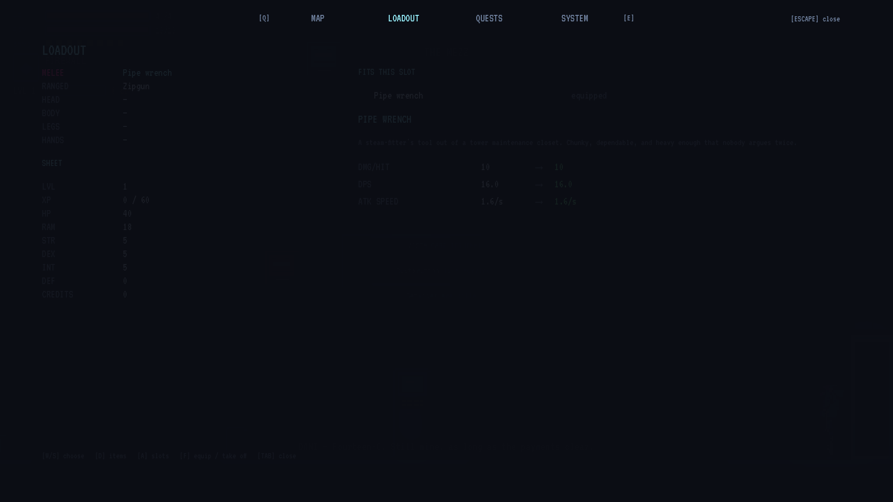
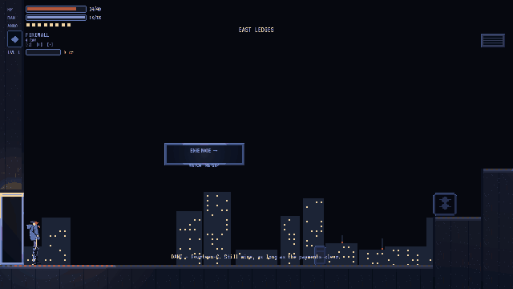

# Neon Debt

*Your legs are financed. The unlock is stolen authority.*

A cyberpunk metroidvania about hardware you own and firmware you do not. Your wall jump, your air dash and your hacks are all corporate property behind paywalls you cannot pay, so you take the authority instead. One district, 34 rooms, one landlord at the end.

## About

The Stacks are thirty-four rooms of low-income housing stacked up the side of a megacity, and every way out of them is licensed to somebody else.

You have legs you are still paying for, a wrench, and Firewall -- the factory-installed hack the corp left on your deck to protect its own collateral. Everything that makes the district climbable is behind a firmware paywall: the Mag-Hook that turns a wall into a staircase, the Cyberdeck that gives you room for a second program, Overload, Breach, the Sidewinder implant that has to be installed by a ripperdoc because gadgets are carried and implants are surgery. Credits never buy an ability in this game. You take the authority instead.

Melee, ranged and hacks share one resource loop, so the enemies force you between them rather than letting you pick a main. Levels and gear are Castlevania's, not an RPG's: numbers you feel in the damage you take, not a build you plan. Two or three ledges are visible and unreachable on purpose -- the double jump is a V2 promise, and you are meant to want it.

This is the vertical slice: thirty to forty-five minutes, one district, one boss. It exists to answer one question, which is whether the rest is worth building.

## Screenshots

*Neon Debt -- a cyberpunk metroidvania about firmware you do not own*

*Unit 14-C. Your apartment, your legs, somebody else's licence*

*The mezzanine: the ripperdoc, the vendor and the only save in the district*

*Melee, ranged and hacks share one resource loop; the Scavs make you switch*

*The Mag-Hook turns a wall into a way up*

*The Landlord collects in person*

*One interconnected district, gated by what you have not stolen yet*

*Gear and levels: Castlevania's RPG layer on a cyberpunk kit*

## Trailer

Video: `shots/trailer.mp4`

## Controls

| | Keyboard | Gamepad |
|---|---|---|
| Move left | A / Left | D-pad left |
| Move right | D / Right | D-pad right |
| Up (menus, doors, lifts) | W / Up | D-pad up |
| Down (menus, drop through) | S / Down | D-pad down |
| Jump (hold for height) | Space | A / Cross |
| Dash | Shift | RB |
| Melee | J | X / Square |
| Ranged | K | LB |
| Cast a hack (costs RAM) | L | Y / Triangle |
| Next hack | E | RS |
| Previous hack | Q | LS |
| Talk, use, pick up | F | B / Circle |
| Map | M | - |
| Gear and stats | Tab | Back |
| Pause / back | Escape | Start |

*Read out of the game's own input map, not typed here.*

## Download

- **windows** (Windows Desktop): `NeonDebt.exe` (104.1 MB), `NeonDebt.pck` (5.9 MB)
- **linux** (Linux): `NeonDebt.pck` (5.9 MB), `NeonDebt.x86_64` (70.1 MB)

Unzip and run the executable; the `.pck` beside it is the game's data and has to stay next to it. `HOW-TO-PLAY.txt` in the download has the keys.

## This build

- Version `v0.1.0`
- `NeonDebt.exe` sha256 `8d11c339e7ca9f44...`
- `NeonDebt.pck` sha256 `0bde98a57abae9ec...`
- `NeonDebt.pck` sha256 `0bde98a57abae9ec...`
- `NeonDebt.x86_64` sha256 `d9f79ab89b5ae369...`
- Changelog: `changelog.md`

## Store fields

- **Genre** Action / Platformer
- **Tags** metroidvania, cyberpunk, pixel-art, action, platformer, rpg
- **Price** free
